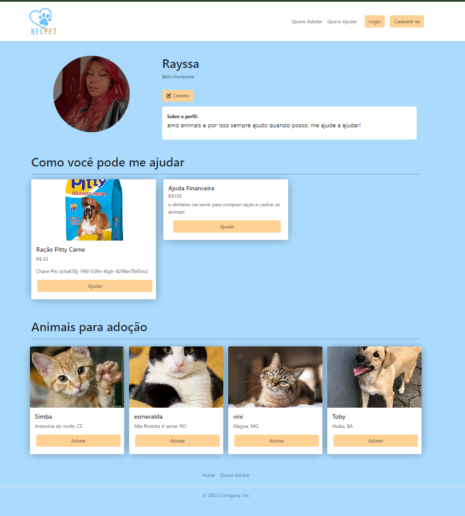

# helpet
plataforma que possibilita a adoção responsável de animais e permite contribuições benevolentes através de doações de ração e remédios 🐾

# Informações do Projeto

**HELPET**

**Engenharia de Software - manhã | PUC Minas**

## Participantes

Os membros do grupo são: 
* Caio Fernandes Botelho
* Isadora Maria de Araújo Cathalat
* Kaio Mendes Araújo Ribeiro
* Leticia Amaral Figueiredo
* Maria Clara de Oliveira Silva
* Matheus Eduardo Marinho de Miranda Hermenegildo
* Rayssa Pierre da Silva Ramiro

# Estrutura do Documento

- [Informações do Projeto](#informações-do-projeto)
  - [Participantes](#participantes)
- [Estrutura do Documento](#estrutura-do-documento)
- [Contexto do Projeto](#contexto-do-projeto)
  - [Problema](#problema)
  - [Objetivos](#objetivos)
  - [Justificativa](#justificativa)
  - [Público-Alvo](#público-alvo)
- [Especificações do Projeto](#especificações-do-projeto)
  - [Personas e Mapas de Empatia](#personas-e-mapas-de-empatia)
  - [Histórias de Usuários](#histórias-de-usuários)
  - [Requisitos](#requisitos)
    - [Requisitos Funcionais](#requisitos-funcionais)
    - [Requisitos não Funcionais](#requisitos-não-funcionais)
  - [Restrições](#restrições)
- [Projeto de Interface](#projeto-de-interface)
  - [User Flow](#user-flow)
  - [Wireframes](#wireframes)
- [Metodologia](#metodologia)
  - [Divisão de Papéis](#divisão-de-papéis)
  - [Ferramentas](#ferramentas)
  - [Controle de Versão](#controle-de-versão)
- [Projeto da Solução](#projeto-da-solução)
  - [Tecnologias Utilizadas](#tecnologias-utilizadas)
  - [Arquitetura da solução](#arquitetura-da-solução)
- [Avaliação da Aplicação](#avaliação-da-aplicação)
  - [Plano de Testes](#plano-de-testes)
  - [Ferramentas de Testes (Opcional)](#ferramentas-de-testes-opcional)
  - [Registros de Testes](#registros-de-testes)
- [Referências](#referências)

# Contexto do projeto
A relação entre homens e animais de estimação é um vínculo profundamente valorizado que evoluiu ao longo de milênios, sendo baseado em companheirismo e em um senso de responsabilidade. Essa peculiar aproximação da sociedade com cães e gatos, muitas vezes transcende as fronteiras das espécies e se torna uma parte integral da vida de muitas pessoas. Contudo, as consequências dessa relação não são apenas benéficas. A Organização Mundial da Saúde (OMS) estima que só no Brasil exista mais de 30 milhões de animais abandonados, entre 10 milhões de gatos e 20 milhões de cães. Em grandes cidades, como Belo Horizonte, a estimativa é que para cada cinco humanos, um cachorro está abandonado.

## Problema

Na sociedade contemporânea, é evidente que o comprometimento das pessoas com seus animais de estimação tem sido frequentemente desprezado em prol de seu próprio conforto. A prática da castração e o fornecimento dos cuidados fundamentais muitas vezes são negligenciados, resultando no alarmante aumento do abandono de inúmeros animais, que acabam vagando pelas ruas à mercê de doenças e maus tratos.

Outros fatores que refletem essa situação são:

* Casas de abrigo superlotadas;
* Falta de um ambiente lúdico que incentive a adoção;
* Conexão mal estabelecida entre adotantes e doadores com as instituições de apoio animal.

## Objetivos

O objetivo geral do grupo é desenvolver uma plataforma que conecte e promova a comunicação entre casas de abrigo animal com possíveis adotantes e doadores de recursos.

### Objetivos específicos

* Reunir as necessidades das casas de abrigo para animais abandonados, com pessoas que pretendem auxiliar no mantimento dessas instituições, através de doações.
* Disponibilizar aos possíveis adotantes informações sobre a localização e a disponibilidade de animais das casas de abrigo.

## Justificativa

Conectar instituições de abrigo de animais abandonados a possíveis adotantes e doadores, pode diminuir a superlotação das casas de abrigo, fornecer maior qualidade de vida para os cachorros e gatos que foram abandonados ou que nunca tiveram um lar e, também, alegrar a vida de alguém com a companhia de um bichinho.

## Público-Alvo

Esse projeto tem o objetivo de alcançar indivíduos com idades compreendidas entre 22 e 50 anos, cuja renda mensal seja igual ou superior a 1,5 salários mínimos.
 
# Especificações do Projeto

As personas e potenciais usuários da aplicação web Helpet são pessoas amantes de animais que querem adotar um pet e/ou que simpatizam com a causa para diminuir o número de animais abandonados nas ruas. Dentre eles estão uma médica veterinária, promotores de adoção e pessoas que buscam adotar um pet. As ferramentas utilizadas para montar as personas e o mapa de empatia foram: O Miro, onde toda a estrutura de dados do processo de Design Thinking foi feita e o Canva, onde foi montado o template das personas e dos mapas.
 
 
> **Exemplo de Persona**
> 
> 
> 
> 
> 
> 
> 

## Histórias de Usuários

Com base na análise das personas formam identificadas as seguintes histórias de usuários:

|EU COMO... `PERSONA`| QUERO/PRECISO ... `FUNCIONALIDADE` |PARA ... `MOTIVO/VALOR`                 |
|--------------------|------------------------------------|----------------------------------------|
|Talita Silva Prado   | Facilitar os registros de animais e procurar pessoas dispostas a adotar animais perdidos, abandonados e\ou resgatados | Esses animais possam receber os melhores cuidados, através de bons profissionais e assim possam achar um lar com carinho e cuidado     |
|Brenda Lima Correia       | Adotar um pet para o seu novo apartamento                 | Ter uma companhia pois se mudou recentemente |
|Miguel Pereira de Assis  | Encontrar instituições de resgate de animais perdidos que aceita trabalho voluntário           | Poder se envolver com essas instituições e conseguir achar animais que precisam de cuidados e levá-los para um novo lar               |
|Julio Gomes Santos       | Adotar um pet para suas filhas                 | Deixá-las felizes pois suas filhas já haviam pedido diversas vezes por um animalzinho |
|Geralda Souza de Oliveira  | Oferecer/achar um lar para seus animais, muitas vezes resgatados           | Que esses animais não voltem para as ruas e para que não fiquem presos num lar              |
|Luciano Pereira       | Achar clínicas veterinárias mais próximas e obter contatos com instituições               | Ter um bom atendimento e para seu pet ter um bom cuidado, além de poder realizar doações e criar campanhas |

## Requisitos

As tabelas que se seguem apresentam os requisitos funcionais e não funcionais que detalham o escopo do projeto.

### Requisitos Funcionais

|ID       | Descrição do Requisito  | 
|----------|-----------------------------------------|
|RF-01| O sistema deve possuir cadastro de PET | 
|RF-02| O sistema deve possuir cadastrar ajuda  | 
|RF-03| O sistema deve possuir cadastro de avaliação  | 
|RF-04| O sistema deve possuir cadastro de ajuda de ração  | 
|RF-05| O sistema deve possuir cadastro de ajuda financeira  | 
|RF-06| O sistema deve possuir cadastro de usuário  | 
|RF-07| O sistema deve possuir cadastro de ajuda veterinária  | 
|RF-08| O sistema deve mostrar Cards de PETS cadastrados | 
|RF-09| O sistema deve mostrar modal com o contato da pessoa  | 
|RF-10| O sistema deve possuir uma barra de pesquisa por filtros de adoção  | 
|RF-11| O sistema deve mostrar os perfis dos PETS cadastrados | 
|RF-12| O sistema deve apresentar o perfil do usuário   | 
|RF-13| O sistema deve apresentar cadastro de perfil do usuário   | 

### Requisitos não Funcionais

|ID     | Descrição do Requisito  |
|-------|-------------------------|
|RNF-01| O sistema deve ser compatível com diferentes navegadores, principalmente, o Google Chrome, Opera, FireFox, Microsoft Edge | 
|RNF-02| O sistema deve responder, de forma correta, ao ser acessado pelo celular |   
|RNF-03| O sistema deve ser capaz de lidar com picos de tráfego, especialmente em momentos de grande interesse pela adoção de animais |   

## Restrições

O projeto está restrito pelos itens apresentados na tabela a seguir.

|ID| Restrição                                             |
|------|-------------------------------------------------------|
|RE-01|O projeto deverá ser entregue no final do semestre letivo, não podendo extrapolar a data de 03/12/2023 |
|RE-02| Apenas organizações registradas como ONGs podem se cadastrar no sistema     |
|RE-03| As doações de vacinas, remédios, rações e produtos de higiene devem ser específicas e aprovadas pelas ONGs |
|RE-04| As publicações no mural de animais perdidos devem estar relacionadas a animais desaparecidos e devem ser apropriadas    |

# Projeto de Interface

  O Projeto de Interface da aplicação web Helpet tem como principal objetivo a realização dos requisitos de divulgação de pets para adoção, divulgação de pedidos de doação vindos de protetores de pets e a realização da comunicação entre quem deseja doar e quem deseja adotar. Dessa forma, criamos algumas telas que pudessem contemplar essas funcionalidades e algumas outras. 
  
   Primeiramente começamos com a Landing Page na qual oferece a qualquer usuário (logado e não logado) observar os pets que estão para adoção e os pedidos de doação de diferentes protetores. Além disso, mesmo sem efetuar o login, o usuário pode clicar no card do pet e analisar todas as informações desse pet, bem como uma foto em tamanho aumentado dele. 
   
   Ainda nessa tela de visualização do pet, o usuário pode acessar o perfil do protetor que divulgou tal pet para adoção e estando no perfil do doador, o usuário pode ver todos os pets que foram divulgados e entrar em contato, bem como ver as informações do doador, como nome, localização, descrição e foto de perfil.
  No entanto, para que alguns requisitos funcionais sejam postos em prática é necessário que o usuário efetue cadastro na nossa aplicação, tal como o login. Tais requisitos são o cadastro de animais para adoção e o cadastro de doações que o protetor necessita.
  
  Muitas histórias de usuário foram contempladas nos requisitos funcionais aplicados nessa interface, tais como a necessidade de adotar um pet para seu novo apartamento da  Brenda Lima Correia e da Geralda Souza de Oliveira de achar um lar para os bichinhos resgatados por ela.

## User Flow

**User Flow**:
 
> 

## Wireframes

 O wireframe do nosso projeto é composto por 16 telas, entre elas estão telas duplicadas de acordo com a visualização do usuário logado e do usuário não logado, além de pop-ups que aparecem de acordo com certas interações do usuário. Dentre as preocupações para a montagem da interface do sistema, estamos estabelecendo foco em questões como agilidade, acessibilidade e usabilidade. Desta forma, o projeto tem uma identidade visual padronizada em todas as telas que são projetadas para funcionamento em desktops.

 
  **Link Protótipo Interativo da Interface**:
 -  [Protótipo interativo da interface do projeto no Figma](https://www.figma.com/proto/2OzhNgJj19MV5CtE7LKHL8/Wireframe-Helpet?type=design&node-id=1-2&t=kfogkoDFc9z1Fwo3-1&scaling=min-zoom&page-id=0%3A1&starting-point-node-id=1%3A2&mode=design)
 -  [Projeto editável interfaces no figma](https://www.figma.com/file/2OzhNgJj19MV5CtE7LKHL8/Wireframe-Helpet?type=design&node-id=0%3A1&mode=design&t=fspLrcbRij8x6Tnw-1)

 ### **Landing Page usuário logado**
 
 A tela Landing Page do usuário não logado mostra as opções que o site oferece aos usuários: a possibilidade de adotar um pet, ajudar um protetor de pets abandonados ou divulgar um pet para adoção. é a primeira tela acessada pelo usuário assim que adentra ao site. Tela padrão.
 
> 
 
  **Landing Page usuário não logado**
 
 > 

 ### **Filtro de Adoção**
 
A tela de filtro de adoção apresenta um filtro inicial para que o usuário filtre os pets para adoção de acordo com os parâmetros escolhidos por ele. Pode ser acessado pelo usuário clicando tando no botão Quero Adotar presente no conteúdo da landing page quando na navbar.

**Usuário não logado**
> 

 **Usuário logado**
 > 

### **Divulgação de um pet**
 
 A tela de Divulgação de um pet apresenta um formulário no qual o usuário logado pode preencher com a descrição dos PETS para adoção. Para desbloquear essa tela é necessário estar logado.

 > 

 ### **Descrição do pet**

A tela de Descrição do Pet apresenta uma foto em tamanho aumentado do pet, o nome do pet e mais algumas descrições dele, apresenta uma aba para que o protetor conte a história do pet em mais detalhes. Além disso, também mostra o nome do protetor que publicou aquele pet e também a localização. O nome do protetor que publicou o pet é clicável e ao realizar essa interação o usuário é transportado para o perfil do protetor onde pode ver algumas outras informações e mais pets.

 **Usuário não logado**
 > 
> 
 **Usuário logado**
 > 

 ### **Entrar em contato para adotar**
 
 A tela de Entrar em contato para adotar abre assim que o botão Entrar em contato na tela descrição do pet é acionado. A tela Entrar em contato para adotar é uma janela modal (surge sobre outras janelas) e nela contém as informações sobre o protetor que está divulgando um pet para adoção

> 

 ## **Perfil do protetor visto pelo usuário**
 
 Essa tela é acionada quando o usuário clica no nome da pessoa protetora na tela de Descrição do PET. Nessa tela é possível observar todos os pets que o protetor divulgou para adoção, além de conter as informações sobre o protetor.

 **Usuário não logado**
 > 
 
 **Usuário logado**
 > 

 ### **Perfil do usuário**
A tela perfil do usuário pode ser acessada a partir de qualquer tela quando o usuário está logado, basta que ele clique no ícone redondo no canto superior direito que é automaticamente redirecionado para seu próprio perfil.
 
> 
> 
 ### **Cadastrar ajuda**
A tela Cadastrar Ajuda é destinada para os usuários protetores de pets que precisam de doações para manterem os seus pets.

**Ajuda Financeira**
> 

**Ajuda Alimentação**
> 

 ### **Login**
A tela de Login precede diversas outras telas que necessitam que o usuário esteja logado para acessar. Uma delas é a tela Divulgar um pet. Essa tela de Login é composta por uma imagem e um formulário onde o usuário vai colocar suas informações de login que foram previamente cadastradas.
 
> 

 ### **Cadastro de novo usuário**
A tela de Cadastro de novo usuário apresenta um formulário no qual novos usuários podem preencher e assim terão acesso a certas funcionalidades exclusivas para usuários logados do site. Além disso, a tela também apresenta um texto em link clicável que redireciona o usuário, caso ele já tenha um cadastro, para a página de login.
 
> 

# Metodologia

A abordagem metodológica abrange dois frameworks: o **Design Thinking** e o **Scrum Framework**. 

O Scrum é caracterizado por sua abordagem adaptativa e colaborativa. A equipe opera em ciclos curtos, adotando flexibilidade no planejamento, desenvolvimento e revisão do trabalho. Isso é facilitado pela comunicação aberta, foco em entregas incrementais e rápida adaptação a mudanças, mantendo o cliente como prioridade central. 
Já o Design Thinking é uma abordagem centrada no usuário para resolver problemas e promover a inovação, envolvendo etapas como empatia, definição, ideação, prototipagem e teste. É usado em diversas áreas e enfatiza a colaboração e a criatividade para criar soluções eficazes e centradas no usuário.

A divisão de papéis e tarefas, as ferramentas empregadas e a gestão de configuração do projeto serão detalhadas nos próximos tópicos.

## Divisão de Papéis

### Scrum Master

* Cleiton Silva Tavares
* Luciana Mara Freitas Diniz

### Product Owner

* Cleiton Silva Tavares
* Luciana Mara Freitas Diniz

### Equipe de Desenvolvimento

| Membro   | Artefato Responsável   |
| -------- | -------- |
| Caio Fernandes Botelho| Processo de  Design Thinking, Título do projeto e Apresentação do Projeto |
| Isadora Maria de Araújo Cathalat |Documentação do Contexto, Projeto de Interface |
| Kaio Mendes Araújo Ribeiro | Processo de  Design Thinking  |
| Leticia Amaral Figueiredo | Documentação do Contexto, Metodologia - Repositório do GitHub, Metodologia - Gestão do projeto |
| Maria Clara de Oliveira Silva | Especificações do Projeto  |
| Matheus Eduardo Marinho de Miranda Hermenegildo | Processo de  Design Thinking, Título do projeto e Apresentação do Projeto  |
| Rayssa Pierre da Silva Ramiro | Especificações do Projeto, Projeto de Interface |

## Divisão de Tarefas

Para organizar e distribuir as tarefas do projeto, nossa equipe está utilizando o recurso de **Kanban** do **GitHub** da seguinte forma:

* To Do: Essa coluna representa as tarefas planejadas para a próxima sprint, ou seja, aquelas que ainda precisam ser realizadas.

* In progress: Quando um membro inicia uma tarefa, ela é movida para esta coluna, indicando que está em andamento.

* In Review: Após a conclusão de uma tarefa, ela é movida para esta coluna, que representa a fase de revisão e teste de qualidade do projeto.

* Done: Tarefas que são movidas para esta coluna estão prontas para serem entregues aos usuários. Neste estágio, as atividades não podem mais ser alteradas pelos membros, pois já passaram com sucesso pelos testes de qualidade antes de serem consideradas concluídas.

## Ferramentas

| Ambiente  | Plataforma              |Link de Acesso |
|-----------|-------------------------|---------------|
|Processo de Design Thinking  | Miro |  https://miro.com/app/board/uXjVMjBSnp0=/?share_link_id=602296142774 | 
|Repositório de código | GitHub | https://github.com/ICEI-PUC-Minas-PMGES-TI/pmg-es-2023-2-ti1-2010100-adocao-de-caes-e-gatos.git | 
|Gerenciamento do Projeto  | Trello** |  https://trello.com/invite/b/dvxxebhl/ATTId3b4ef75b2fb03343765c3ba910e0dbc1E8B3BC3/adote-um-doguinho | 
|Protótipo Interativo | Figma | https://www.figma.com/proto/2OzhNgJj19MV5CtE7LKHL8/Wireframe-Helpet?type=design&node-id=1-2&t=es5cU9YuNdBPncC8-1&scaling=min-zoom&page-id=0%3A1&starting-point-node-id=1%3A2&show-proto-sidebar=1 | 

***observação*: não foi possível conseguir o link do Kanban (GitHub Projects), tal ação requer um maior nível de acesso ao sistema. Por isso, segue o link do Trello.

As ferramentas empregadas no projeto são:

- Editor de código: VS Code
- Ferramentas de comunicação: WhatsApp
- Ferramentas de diagramação: Figma e Miro
- Plataforma de hospedagem: GitHub
 
O editor de código foi escolhido porque ele possui uma integração com o
sistema de versão. As ferramentas de comunicação utilizadas possuem
integração semelhante e por isso foram selecionadas. Por fim, para criar
diagramas utilizamos essa ferramenta por melhor captar as
necessidades da nossa solução.

## Controle de Versão

A ferramenta de controle de versão adotada no projeto foi o
[Git](https://git-scm.com/), uma escolha sólida para o gerenciamento eficiente do código-fonte. Além disso, o [Github](https://github.com) foi utilizado para a hospedagem do repositório `upstream`, proporcionando um ambiente colaborativo e seguro para a equipe de desenvolvimento compartilhar e revisar o código, facilitando assim a colaboração e o acompanhamento das alterações ao longo do projeto.
 
 O projeto segue a seguinte convenção para o nome de branchs:
 
- `master`: versão estável já testada do software
 - `unstable`: versão já testada do software, porém instável
 - `testing`: versão em testes do software
 - `dev`: versão de desenvolvimento do software
 
 Quanto à gerência de issues, o projeto adota a seguinte convenção para
 etiquetas:
 
 - `bugfix`: uma funcionalidade encontra-se com problemas
 - `enhancement`: uma funcionalidade precisa ser melhorada
 - `feature`: uma nova funcionalidade precisa ser introduzida

# Projeto da Solução

A criação do HELPET representa uma solução inovadora e eficar para conectar animais em busca de um lar e pessoas com vontade de ter um animalzinho. O site busca proporcionar uma experiência única e fácil, permitindo que os interessados naveguem por perfis detalhados de animais disponíveis para adoção. Além disso, HELPET procura ajudar nas questões de alimentação e de cuidados veterinários, oferecendo diversas opções de doação. Ao simplificar o processo de adoção e promover a transparência, essa solução não apenas aumenta as chances de encontrar lares permanentes para animais abandonados, mas também contribui para conscientização sobre a importância da adoção responsável e do bem-estar animal.

## Tecnologias Utilizadas

As tecnologias utilizadas foram:

- JavaScript:
   * Utilizado para fazer a manipulação do DOM

- Bootstrap5.0:
   * Utilizado para estilizar o site e deixa-lo responsivo

- Html 5:
   * Utilizado para fazer a estrutura do site

## Funcionalidades do Sistema (Telas) 

Nesta seção são apresentadas as telas desenvolvidas para cada uma das funcionalidades do sistema. 

- Entrega Sprint 2 

- Cadastro de PETS
* (RF-01) 
* Aluno responsável: Isadora Maria de Araujo Cathalat
* A tela de cadastro e onde novos PETS podem ser cadastrados. 
* Um exemplo da tela é apresentada na Figura abaixo

> 

- Requisitos atendidos 
  * RF-01 
- Artefatos da funcionalidade 
  * index.html 
  * cadastro-pet.js 
  * main.css 
  * pet-laerte.jpg 
  * pet-penelope.jpg 
  * pet-perola.jpg 
  * pet-simba.jpg 
  * pet-zeca.jpg 

- Mostrar CARDS dos PETS
* (RF-08) 
* Aluno responsável: Maria Clara de Oliveira Silva
* A tela mostra cards dos PETS cadastrados
* Um exemplo da tela é apresentada na Figura abaixo

> 

- Requisitos atendidos 
  * RF-08 
- Artefatos da funcionalidade 
  * index.html 
  * main.js 
  * style.css 
  * 1.jpg/ 2.jpg / 3.jpg / 4.jpg / 5.jpg / 6.jpg / 7.jpg / 8.jpg / 9.jpg / 10.jpg / 11.jpg /12.jpg 

- Mostrar Perfil do Pet
* (RF-11) 
* Aluno responsável: Letícia Amaral Figueiredo
* A tela de perfis dos PETS cadastrados
* Um exemplo da tela é apresentada na Figura abaixo

> 
- Requisitos atendidos 
  *RF-11 
- Artefatos da funcionalidade 
  * index.html 
  * perfilPet.js 
  * perfilPet.css 
  * pet-perola.jpg 

- Entrega Sprint 3 

- Cadastro do Perfil de usuário 
* (RF-12) 
* Aluno responsável: Kaio Mendes
* A tela de cadastro dos perfis dos usuários 
* Um exemplo da tela é apresentada na Figura abaixo

> 

- Requisitos atendidos 
  * RF-12
- Artefatos da funcionalidade 
  * index.html 
  * script.js 
  * styles.css 

- Cadastro de contribuição financeira 
* (RF-05) 
* Aluno responsável: Matheus Eduardo Marinho de Miranda Hermenegildo
* A tela de cadastro para contribuir financeiramente
* Um exemplo da tela é apresentada na Figura abaixo

> 

- Requisitos atendidos 
  *RF-05
- Artefatos da funcionalidade 
  * cadastro-financeiro.html 
  * cadastro-financeirot.js 
  * main.css 

- Perfil do usuário cadastrado
* (RF-13) 
* Aluno responsável: Rayssa Pierre da Silva Ramiro
* A tela de perfil de usuários cadastrados
* Um exemplo da tela é apresentada na Figura abaixo

> 

- Requisitos atendidos 
  * RF-13
- Artefatos da funcionalidade 
  * perfil-usuario.html 
  * userinfo.js 
  * style.css 

## Arquitetura da solução

Diagrama de Componentes
Os componentes que fazem parte da solução são apresentados na Figura que se segue
> 
> 
> 

# Avaliação da Aplicação

## Plano de Testes

- 6.1 Plano de Testes de Software

Requisitos para Realização do Teste:

Site publicado na Internet
Navegador de Internet - Chrome, Firefox, Edge ou Opera
Conectividade de Internet para acesso às plataformas (APIs)
Caso de Teste | CT-01 - Cadastro de PET
Requisitos:

RF-01: O sistema deve possuir cadastro de PET
RF-06: O sistema deve possuir cadastro de usuário
Objetivo do Teste: Verificar se o sistema está cadastrando PETs corretamente.

Passos do Teste:

Acessar o navegador
Informar o endereço do site
Visualizar a página de cadastro de PET
Introduzir as informações necessárias do PET
Verificar o processo de cadastro
Critérios de Êxito:

Após o cadastro, a tela principal deve apresentar o perfil do PET.
(Estrutura semelhante para outros casos de teste CT-02 a CT-08)

> **Links Úteis**:
> - [IBM - Criação e Geração de Planos de Teste](https://www.ibm.com/developerworks/br/local/rational/criacao_geracao_planos_testes_software/index.html)
> - [Práticas e Técnicas de Testes Ágeis](http://assiste.serpro.gov.br/serproagil/Apresenta/slides.pdf)
> -  [Teste de Software: Conceitos e tipos de testes](https://blog.onedaytesting.com.br/teste-de-software/)

## Registros de Testes

- 6.2 Registro de Testes de Software

* CT-01: O cadastro de PET ocorreu sem erros.
* CT-02: O login ocorreu como esperado.
* CT-03: Ao fazer este teste, descobrimos um problema no local storage, que foi corrigido na versão final.
* CT-04: O drag das tarefas funciona conforme esperado apenas em desktop.
* CT-05: Nenhum erro encontrado durante o teste.
* CT-06: A API está funcionando sem demonstrar problemas.
* CT-07: Nenhum erro encontrado durante o teste.
* CT-08: A troca de imagem ocorreu sem erros.

- 6.3 Plano de Testes de Usabilidade

Objetivo: Confirmar se a interface é amigável para usuários de diferentes faixas etárias.

- Participantes do Teste:

Usuário de 25 anos
Usuário de 60 anos
Tarefas do Teste:

Criar uma nova conta de adoção de PET
Configurar o perfil do usuário
Cadastrar um novo PET e configurá-lo
Apagar o PET criado
Deslogar da aplicação e logar novamente

- 6.4 Registro de Testes de Usabilidade

Usuário (25): Sem dificuldades, achou a interface fácil de usar e gostou do layout e das cores.
Usuário (60): Encontrou pequenos problemas na configuração do usuário e no tamanho da fonte. Sugeriu aumentar o tamanho da fonte para melhor legibilidade.

# Referências

> **Links Úteis**:
> - [Formato ABNT](https://www.normastecnicas.com/abnt/trabalhos-academicos/referencias/)
> - [Referências Bibliográficas da ABNT](https://comunidade.rockcontent.com/referencia-bibliografica-abnt/)

# Referências

> **Links Úteis**:
> - [Jus Brasil - Dado sobre Animais Abandonados]([https://www.normastecnicas.com/abnt/trabalhos-academicos/referencias/](https://www.jusbrasil.com.br/noticias/brasil-tem-30-milhoes-de-animais-abandonados/100681698))
